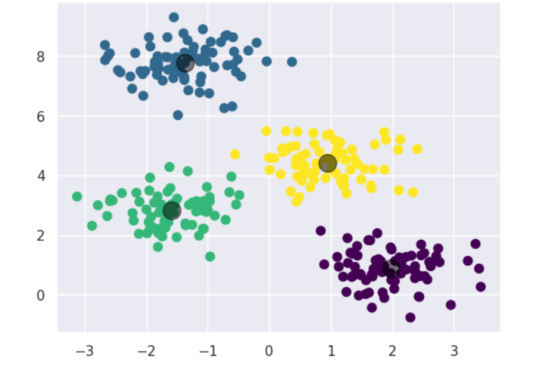

# 🔬 Cancer Prediction System

An interactive web app for breast cancer classification using Machine Learning. Enter tumor diagnostic features and get an instant Benign/Malignant prediction.

**[🚀 Live Demo](https://matam-rohith.github.io/Cancer_Prediction/)**



## Overview

- **Dataset:** UCI Wisconsin Breast Cancer Dataset (569 samples, 30 features)
- **Output:** Binary classification — Benign or Malignant
- **Best Accuracy:** 97.4% (SVM)

## Algorithms Used

| Algorithm | Accuracy |
|-----------|----------|
| SVM | 97.4% |
| Random Forest | 96.5% |
| Logistic Regression | 95.6% |
| KNN | 95.1% |
| Decision Tree | 93.0% |

## Features

- 30 diagnostic input features (mean, SE, worst)
- Real-time prediction with confidence score
- Pre-fill with real Benign/Malignant examples
- Fully frontend — no backend needed

## Tech Stack

- **ML:** Python, scikit-learn, pandas, numpy, matplotlib
- **Web:** HTML, CSS, JavaScript
- **Notebook:** Jupyter / Google Colab

## Run Locally

```bash
git clone https://github.com/Matam-Rohith/Cancer_Prediction
cd Cancer_Prediction
# Open index.html in browser
```

---
Built by [Matam Rohith](https://rohith-portfolio-six.vercel.app/)
